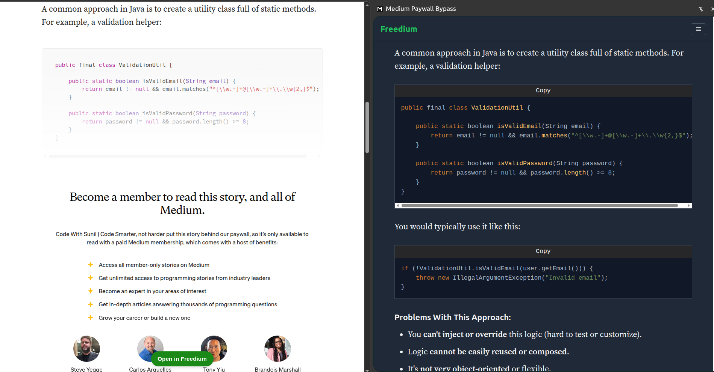
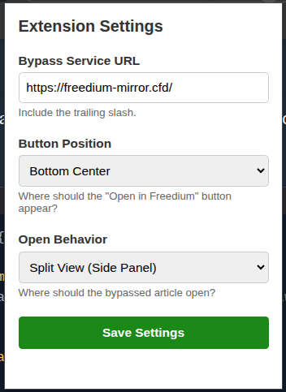

# Medium Paywall Bypass (Chrome Extension)

A lightweight Google Chrome extension that helps you seamlessly read premium, "Member-only" articles on Medium and Towards Data Science by automatically redirecting them to a fast mirror service.

## Features

- **Automatic Detection**: Intelligently detects when an article is behind a paywall (even dynamically as you navigate).
- **Floating Action Button**: Adds a green "Read Full Article" hovering button exclusively to premium articles.
- **Customizable Open Behaviors**:
  - **Current Tab**: Replace the active page with the full article.
  - **New Tab**: Open the full article in the background.
  - **Split View (Side Panel)**: Slide out Chrome's native side panel to read the full article alongside the original page!
- **Adjustable Positioning**: Move the floating button to any corner of the screen via the extension's options menu.
- **Privacy First**: No tracking, no analytics. It perfectly delegates reading to the mirror service.

## How to Install (Developer Mode)

Because this extension bypasses paywalls, it is not available on the official Chrome Web Store. You must install it manually using "Developer mode". 

It only takes a minute!

1. **Download the Extension:**
   - Clone or download this repository to your computer.
   - If you downloaded a `.zip` file, extract it to a folder you won't delete (like your Documents folder).
2. **Open Extensions in Chrome:**
   - Open Google Chrome.
   - Click the three vertical dots ( ⋮ ) in the top right corner.
   - Go to **Extensions** -> **Manage Extensions**. 
   - *(Alternatively, type `chrome://extensions/` into your URL bar and hit Enter).*
3. **Enable Developer Mode:**
   - In the top right corner of the Extensions page, toggle **Developer mode** to ON.
4. **Load the Extension:**
   - Click the **Load unpacked** button that appeared in the top left.
   - Browse to the folder where you saved this project.
   - Select the `chrome-extension` directory and click **Select Folder**.
5. **Pin It:**
   - Click the "puzzle piece" extension icon in your Chrome toolbar.
   - Find "Medium Paywall Bypass" and click the pushpin icon to pin it to your bar for easy access to the Settings.

## How to Use

1. Navigate to any `medium.com` article. 
2. If it is a free article, read as normal! The extension stays hidden.
3. If it is a premium article (marked with a star), a green "Read Full Article" button will appear at the bottom of your screen. Click it!

### Changing Settings
Click the "M" icon in your browser toolbar to open the settings menu. From here, you can change where the floating button appears, or choose to open articles in Split View instead!

## ⚠️ Disclaimer

This extension is intended **strictly for educational and personal use only**.

- This project does **not** host, reproduce, distribute, or store any content from Medium or any other platform.
- It works by redirecting the user's browser to a **publicly available third-party mirror service** — it does not scrape, clone, or modify any copyrighted content itself.
- The author of this extension is **not affiliated with, endorsed by, or in any way connected to Medium, Towards Data Science, or any of their parent companies**.
- Using this tool may be a violation of [Medium's Terms of Service](https://policy.medium.com/medium-terms-of-service-9db0094a1e0f). **Use at your own risk and discretion.**
- If you find value in an author's work, please consider **supporting them directly** by subscribing to Medium or clapping for their articles.
- This repository is provided **as-is**, with no warranties. The author assumes **no liability** for any misuse or consequences arising from its use.

> **TL;DR**: This tool simply redirects your browser. It does not steal, copy, or republish anyone's content. Please respect content creators and use responsibly.